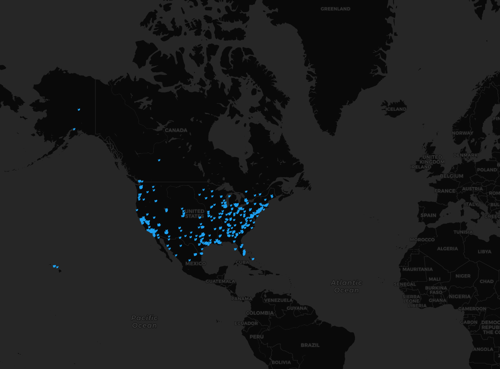
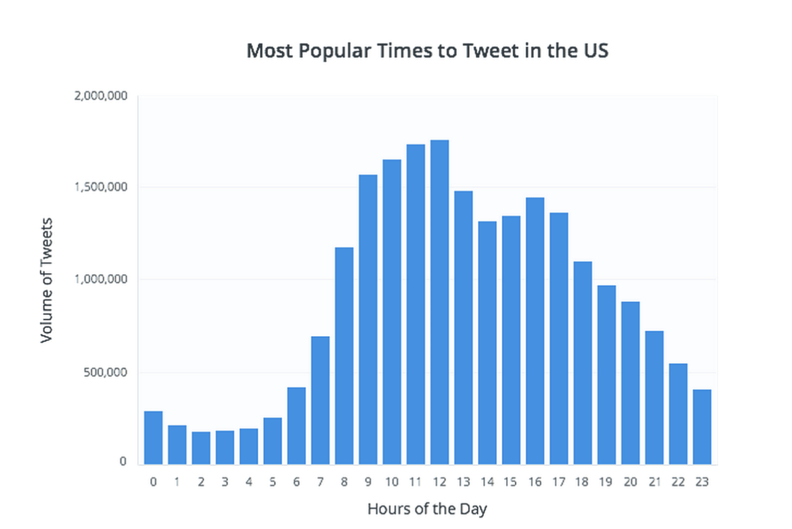

# geog458-lab02

## Lab 2: Geo-tagged tweet collection and visualization

Link for binder:

This map was created by aggregating tweets using the Twitter Developer API and Tweepy library. The data was added on to a dark base layer using QGIS. I used a custom SVG to show each tweet using the blue twitter bird. Initially, I wanted to visualize the popularity of certain ublic figures like New York Governor Andrew Cuomo across the US. This would produce interesting results as he is the governor of a state but also in the news nationwide so I would expect clusters around New York and then mini clusters around popular cities in the country. But tweepy didn't allow me to filter with both location AND keyword so I settled with location data only and gathered tweets around the US. The data was recorded at 10 PM to see the difference between tweets from each area in the country. From this map, we can see that there are more tweets on the west coast at this time, than on the east coast. We can see that on the west coast, these are clustered in the popular cities, such as Seattle, Oregon, San Francisco and Los Angeles.

As we can see from the data from [Buffer](https://buffer.com/resources/best-time-to-tweet-research), the frequency of tweets in the US is decent at around 10 pm but lower around 1 AM. The map shows this since the East Coast time is 1 AM, therefore less tweets than usual.

